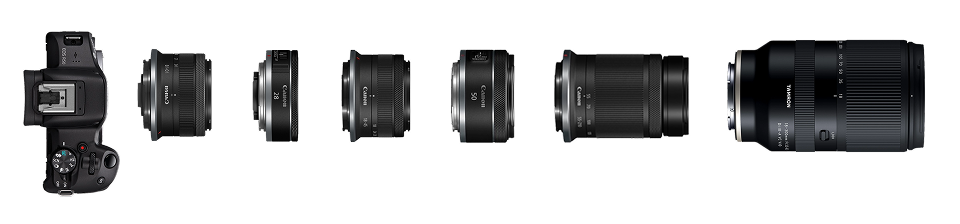
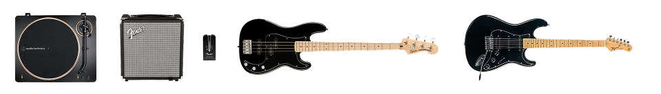

**Last update**: August 2026

Welcome to my `/uses` page that list all my tools, hardware, and software! As a tech enthusiast and professional, I'm constantly on the lookout for the best gear and apps to make my life easier and more productive. This page is my curated collection of the tools I use on a daily basis, sorted by category for easy browsing.

## 💻 Workstation

- **Computer**: Mac Mini 2024 Apple M4, 16GB RAM, 256 GB SSD.
- **Peripherals**: Magic Keyboard with Touch ID (USB-C) & Magic Mouse (USB-C).
- **External Display**: Dell 27" 4k USB-C Monitor p2721q.
- **Webcam**: Logitech C920S Pro HD Webcam.
- **Audio**: Apple AirPods Pro 3 and Edifier W820NB Plus.
- **Hub**: UGREEN 11-in-1 Docking Station with 2TB SSD Expansion.
- **Desk**: Husky Standing Desk with custom top.

## 🧑🏾‍💻 Programming

- **Editor**: Visual Studio Code with [Jetbrains Mono](https://www.jetbrains.com/lp/mono/) font, [Shades of Purple](https://marketplace.visualstudio.com/items?itemName=ahmadawais.shades-of-purple) theme and several helpful extensions, including [Auto Close Tag](https://marketplace.visualstudio.com/items?itemName=formulahendry.auto-close-tag), [Auto Rename Tag](https://marketplace.visualstudio.com/items?itemName=formulahendry.auto-rename-tag), [Color Highlight](https://marketplace.visualstudio.com/items?itemName=naumovs.color-highlight), [Dart](https://marketplace.visualstudio.com/items?itemName=Dart-Code.dart-code), [DotENV](https://marketplace.visualstudio.com/items?itemName=mikestead.dotenv), [EditorConfig for VS Code](https://marketplace.visualstudio.com/items?itemName=EditorConfig.EditorConfig), [ESLint](https://marketplace.visualstudio.com/items?itemName=dbaeumer.vscode-eslint), [Material Icon Theme](https://marketplace.visualstudio.com/items?itemName=PKief.material-icon-theme), [Flutter](https://marketplace.visualstudio.com/items?itemName=Dart-Code.flutter), [GraphQL: Language Feature Support](https://marketplace.visualstudio.com/items?itemName=GraphQL.vscode-graphql), [GraphQL: Syntax Highlighting](https://marketplace.visualstudio.com/items?itemName=GraphQL.vscode-graphql-syntax), [PlantUML](https://marketplace.visualstudio.com/items?itemName=jebbs.plantuml), [Polacode](https://marketplace.visualstudio.com/items?itemName=pnp.polacode), [Thunder Client](https://marketplace.visualstudio.com/items?itemName=rangav.vscode-thunder-client), [Prettier - Code formatter](https://marketplace.visualstudio.com/items?itemName=esbenp.prettier-vscode), [Rainbow CSV](https://marketplace.visualstudio.com/items?itemName=mechatroner.rainbow-csv), [MDX](https://marketplace.visualstudio.com/items?itemName=unifiedjs.vscode-mdx) and [YAML](https://marketplace.visualstudio.com/items?itemName=redhat.vscode-yaml).
- **Terminal**: Native macOS Terminal with Oh My Zsh.
- **Stack**: JavaScript, TypeScript, React, React Native, Gatsby, Next.js, NodeJS, MySQL, and MongoDB.

# 📱 Mobile

- **Phone**: Apple iPhone 17 Pro Max 512GG Silver.
- **Watch**: Apple Watch Series 8 GPS 45mm Starlight Aluminum.
- **Tablet**: Apple iPad Air M2 11" 256GB Starlight with Apple Pencil Pro.
- **e-Reader**: Xteink X4 with custom Crossink firmware.

## 📷 Photography

### Canon
- **Body**: Canon EOS R50.
- **Lenses**:
  - Canon RF-S 10-18mm f/4.5-6.3 IS STM.
  - Canon RF 28mm f/2.8mm STM (for street photography/everyday carry due to its small size).
  - Canon RF-S 18-45mm f/4.5-6.3 IS STM (kit lens).
  - Canon RF 50mm f/1.8mm STM (for portraits and general photography).
  - Canon RF-S 55-210mm f/5-7.1 IS STM.
  - Tamron 18-300mm f/3.5-6.3 Di III-A VC VXD (for landscape and travel photography).

## 🎸 Jam

- **Turntable**: Audio-technica AT-LP70XBT Black/Bronze.
  - You can find my vinyl collection [here](https://vinyl.diegocosta.me/).
- **Amp**: Fender Rumble 15 and Fender Mustang Micro.
- **Bass**: Fender Squier Affinity Series Precision Bass PJ, color black.
- **Guitar**: Tagima Strato TG-540, color black.

> This page was inspired by Wes Bos and the community at [uses.tech](https://uses.tech)
